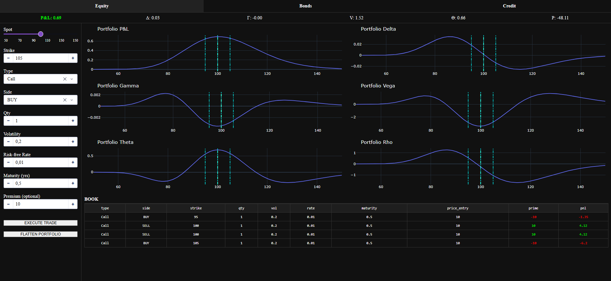
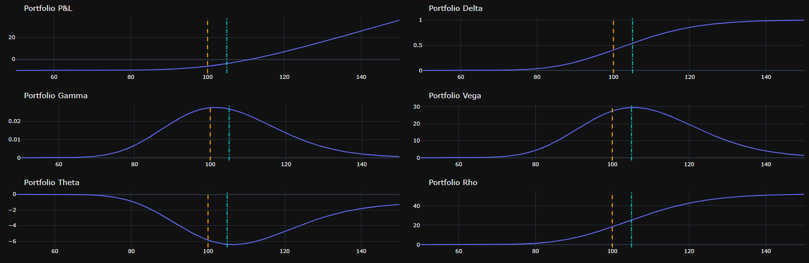

# 🏦 Options Trading Dashboard

[](https://www.python.org/)
[](LICENSE)

A **Python/Dash application** for managing a portfolio of European options.  
Compute **Black-Scholes prices**, Greeks, and visualize portfolio risk **in real-time**.

---

## 🚀 Features

- **Option Pricing & Greeks**
  - Price, Delta (Δ), Gamma (Γ), Vega (V), Theta (Θ), Rho (Ρ)
- **Portfolio Management**
  - Add / remove option positions
  - Track P&L and portfolio Greeks
- **Interactive Dashboard**
  - Trade inputs: Spot, Strike, Type, Side, Qty, Volatility, Rate, Maturity, Premium
  - Real-time **risk strip** and dynamic graphs
  - Book table with **conditional formatting**
- **Tabbed Interface**: Equity, Bonds, Credit (Equity fully implemented)

---

## 🖼️ Live Preview

Even if you haven’t cloned the repo, you can **visualize the dashboard**:

### Dashboard Overview


### Risk Strip & PnL Graphs


### Book Table Example


### Optional GIF Preview


> 💡 Tip: Replace the placeholders above with your actual screenshots or GIFs in `docs/screenshots/`.

---

## 🛠️ Installation

1. **Clone the repository:**

```bash
git clone https://github.com/yourusername/options-trading-dashboard.git
cd options-trading-dashboard
```

2. **Create and activate a virtual environment**

- **macOS / Linux:**
```bash
python -m venv venv
source venv/bin/activate
```

- **Windows (cmd.exe):**
```cmd
python -m venv venv
venv\Scripts\activate
```

- **Windows (PowerShell):**
```powershell
python -m venv venv
.\venv\Scripts\Activate.ps1
```

3. **Install dependencies:**

```bash
pip install -r requirements.txt
```

---

## ⚡ Usage

Run the dashboard:

```bash
python app.py
```

- **Left panel**: enter trades (Spot, Strike, Call/Put, BUY/SELL, Qty, Vol, Rate, Maturity, Premium)
- **Right panel**: PnL and Greeks graphs, Book Table
- **Buttons**: `EXECUTE TRADE` to add an option, `FLATTEN PORTFOLIO` to clear all positions

---

## 📂 Project Structure

```
├── app.py               # Entry point
├── models/
│   ├── black_scholes.py  # Black-Scholes pricing & Greeks
│   ├── option.py         # Option class
│   └── portfolio.py      # Portfolio aggregation
├── controllers/
│   └── trade_controller.py  # Dash callbacks
├── views/
│   ├── dash_app.py       # Dash layout
│   ├── book_table.py     # Portfolio book DataTable
│   └── graph_panel.py    # Graph panel for PnL & Greeks
├── docs/
│   └── screenshots/      # Project screenshots / GIFs for preview
├── requirements.txt
└── README.md
```

---

## 🔍 Classes Overview

| Class | Responsibility |
|-------|----------------|
| `BlackScholes` | Compute European option price & Greeks |
| `Option` | Represents a single option trade with PnL |
| `Portfolio` | Aggregates options, computes portfolio PnL & Greeks |
| `GraphPanel` | Creates Plotly figures for portfolio metrics |
| `BookTable` | Dash DataTable showing portfolio positions |
| `DashApp` | Sets up Dash layout and components |
| `TradeController` | Registers Dash callbacks for trades & updates |

---

## 🛠 Future Improvements

- Implement **Bonds** and **Credit** tabs
- Add **volatility surface support**
- Enable **multi-asset portfolios**
- Integrate **real market data**
- Export portfolio reports as CSV/Excel

---

